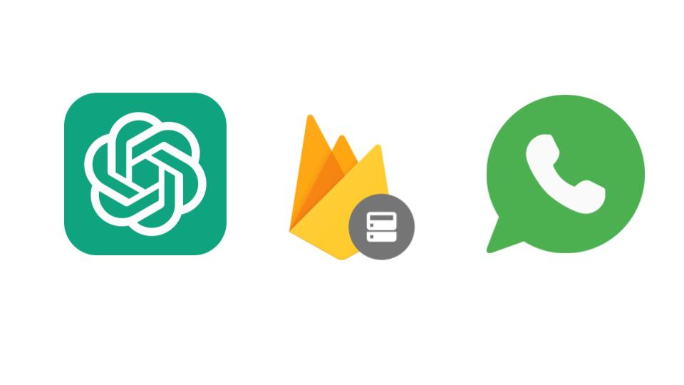

# Whats-GPT-Firebase


Whats-GPT-Firebase is a Node.js application that integrates the WhatsApp Web API, OpenAI's GPT-3.5 language model, and Firebase Realtime Database. It allows you to interact with a WhatsApp chatbot powered by OpenAI's GPT-3.5 model and store the chat history in Firebase.

## Table of Contents
- [Installation](#installation)
- [Usage](#usage)
- [Contributing](#contributing)
- [License](#license)

## Installation

1. Clone the repository to your local machine:
   ```
   git clone https://github.com/enghamzasalem/whats-gpt-firebase.git
   ```
2. Navigate to the project directory:  
 ``` 
 cd whats-gpt-firebase
 ```
3. Install the dependencies:
``` 
 npm install
```
* Set up Firebase:

4. Create a new Firebase project in the [Firebase Console](https://firebase.google.com/docs/web/setup).
Replace the Firebase configuration values in the .env file with your project's configuration values. Refer to the Firebase documentation for more information on obtaining your project's configuration.
Make sure your Firebase project has the Realtime Database enabled.
* Set up OpenAI:

5. Obtain an API key from [OpenAI](https://platform.openai.com/account/api-keys).
Replace the placeholder OPEN_AI_KEY in the code with your actual OpenAI API key.
# Usage
To run the application, use the following command:
```
node index.js
```

* Once the application is running, you can access it through a web browser or use the provided endpoints http://localhost:3500.

* To authenticate with WhatsApp, open your browser and navigate to http://localhost:3500/authenticate/{phoneNumber}/{prompt}

* Replace {phoneNumber} with your WhatsApp phone number (including the country code) and {prompt} with the initial message you want to send to the chatbot.
* A QR code will be generated, which you need to scan using the WhatsApp app on your phone. Once scanned, you will be authenticated with WhatsApp and ready to start interacting with the chatbot.
* You can also use the /submit endpoint with a POST request to authenticate. Pass the phone number and prompt in the request body.
The chat history will be stored in Firebase Realtime Database under the /links/test/{chatId} path.
# Contributing
Contributions to Whats-GPT-Firebase are welcome! If you find any issues or have suggestions for improvements, please open an issue or submit a pull request.

# License
This project is licensed under the [MIT License](https://opensource.org/license/mit/).

License Attribution:
Developer Relations: [Hamza Salem](https://enghamzasalem.com/)


